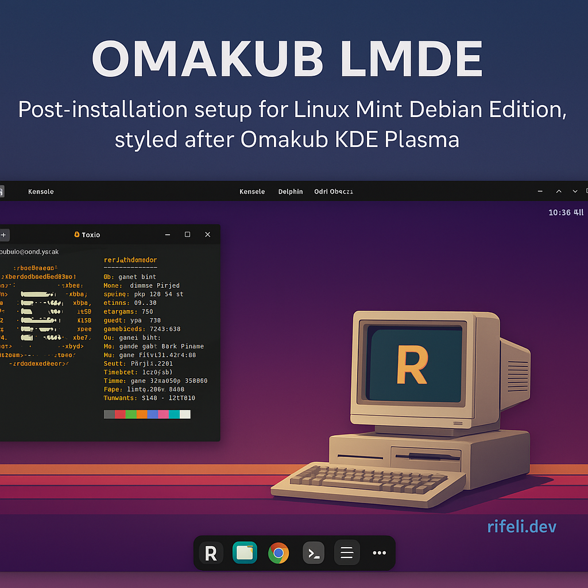

# LMDE Post-Install Script (Omakub Style)



This project contains a post-install script to transform Linux Mint Debian Edition (LMDE) into a beautiful and productive KDE Plasma environment inspired by [Omakub](https://omakub.org).

## Features
- Installs KDE Plasma on LMDE
- Adds developer tools and essential packages
- Sets up Zsh + Oh My Zsh
- Installs Starship prompt
- Adds aliases for `kubectl` and `git`
- Downloads and installs Sweet theme and Tela icons
- Applies KDE theme and icons using `lookandfeeltool`
- Enables blur and window transparency effects via `kwriteconfig5`
- Installs Latte Dock and imports pre-defined layout
- Sets custom retro wallpaper with rifeli.dev branding
- Adds global shortcut (Ctrl+Alt+T) to open terminal
- Applies custom KDE color scheme, hot corners, and window rules
- Includes preview screenshot and icons structure for future expansion

## Requirements
- Clean LMDE installation
- Internet connection

## How to Use
```bash
git clone https://github.com/leonardorifeli/lmde-omakube-install.git
cd lmde-omakube-install
chmod +x install.sh
./install.sh
```

## To Do
- Add more Latte Dock layout variations
- Expand icons with custom "rifeli" branding
- Add full system backup and restore options
- Add light/dark toggle and user-friendly theme selector

## License
MIT License